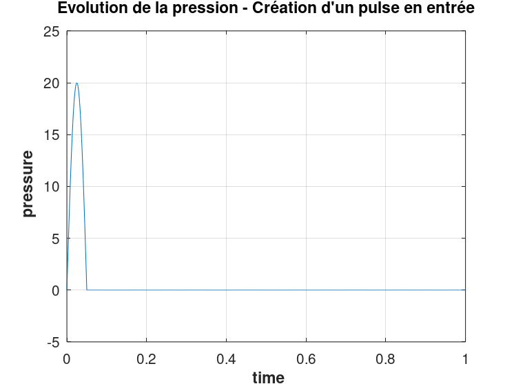
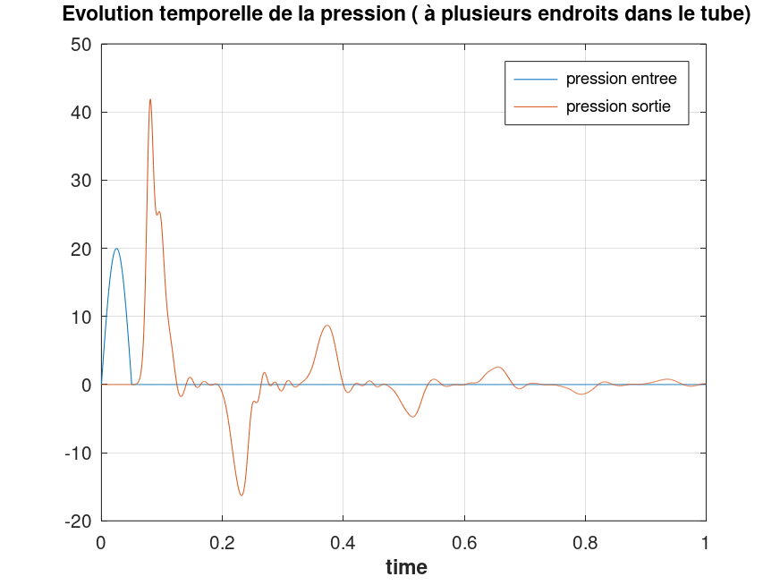
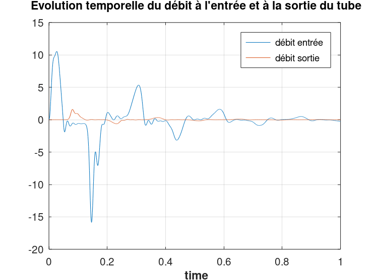
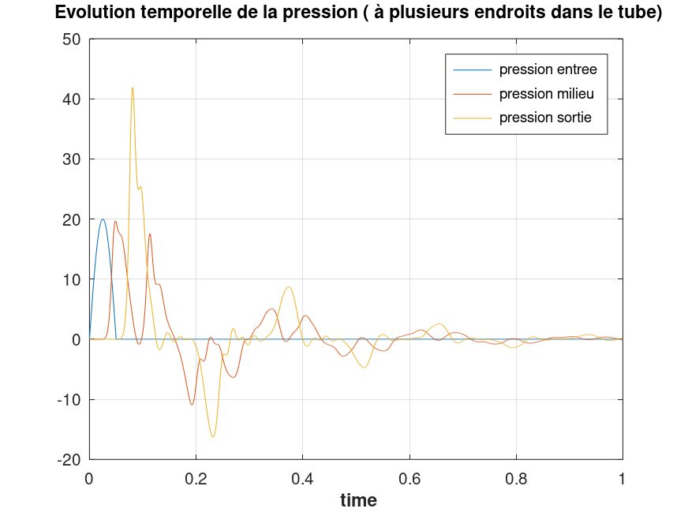
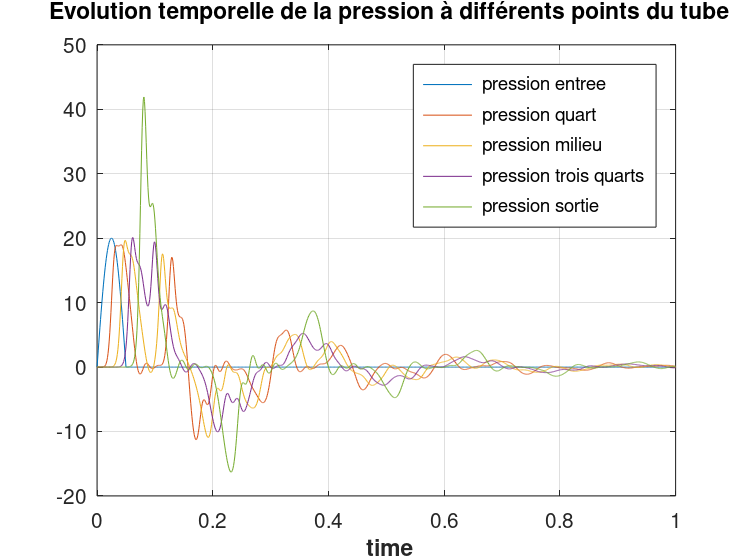
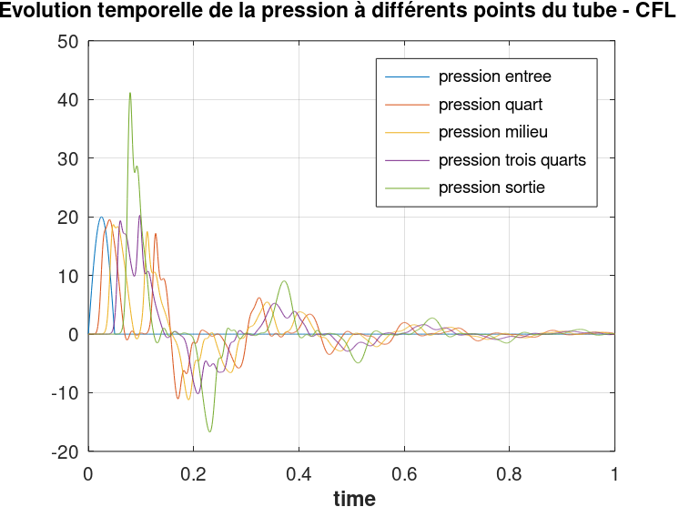
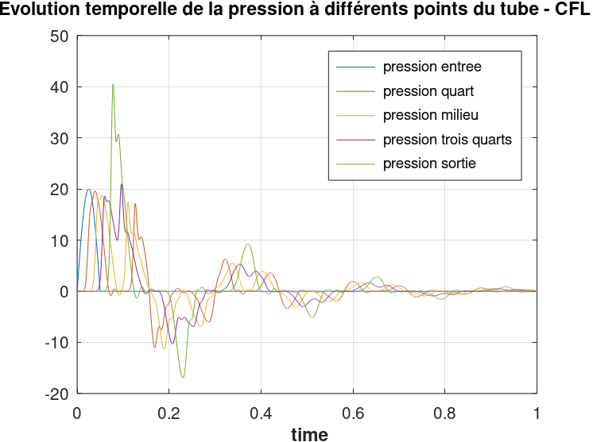
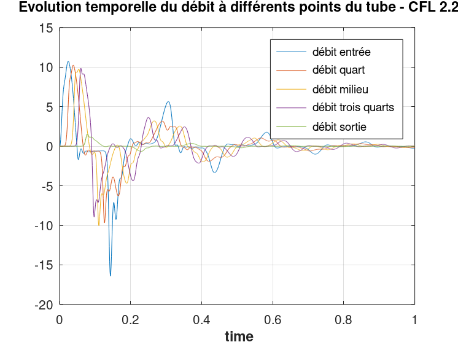

# Résultats du TP : 

**Présentation des cas étudiés et interprétation des résultats**

La première partie de notre travail dans ce cours s'est basée sur une simulation numérique 1D (considérant que le temps et la position longitudinale dans le tube comme variables), qui permet de modéliser la manière dont le sang s’écoule dans un vaisseau sanguin. 

C'est en retravaillant ce programme, en y ajoutant de nouvelles conditions d'entrée, de sortie et en testant différents paramètres de pression, élastance ou viscosité que nous avons pu mettre au point les résultats de la partie qui suit.

## Présentation du programme initial

## Variations de la densité du sang passant dans le tube

## Résultats : Nouvelle condition d'entrée - pulse

Comme le coeur envoie du sang dans les artères de manière pulsée, il fut rapidement envisagé de reproduire une pulsation à l'entrée du vaisseau que l'on souhaite modéliser.

Nous souhaitons donc reproduire une surpression à l'entrée du tube.
Pour modéliser cela, nous avons changé les paramètres de pression en entrée pour y faire intervenir une sinusoïde (pour obtenir des résultats plus lisibles).

La pression aurait donc la forme suivante en entrée :

puis, cette perturbation se propagerait tout le long du tube.
Si nous traçons cette perturbation de pression en entrée en fonction du temps, nous pouvons obtenir la figure suivante :

Les résultats relatifs aux essais avec cette nouvelle condition d'entrée seront développés par la suite.

## Prise de pression et de débit à différents endroits dans le tube

Les résultats présentés ici seront basés sur les paramètres suivants :

- Elastance du tube EL : ``1367000`` dyn/cm2
- Section du tube : ``0.1361`` cm2
- Longueur du tube  L : ``25`` cm
- Densité du fluide : ``1.06`` kg/m3
- Viscosité du fluide : ``35`` millipoises [mP]

Ces données réfèrent à du sang passant dans une carotide.
On travaille ici sur un fluide supposé newtonien, la viscosité sera donc supposée constante. De même, on suppose ici la section A0 constante.

En reprenant la condition d'entrée introduite précédemment et en traçant la pression à la sortie du tube, il vient :

La pression en sortie est significativement supérieure au pulse imposé en entrée (plus de deux fois supérieure). Cela est dû notamment aux refléxions tout au long du tube, qui pousse une plus grande quantité à la fois à la sortie du tube et provoque une surpression.

Nous pouvons d'ailleurs mettre cela en parallèle avec l'évolution du débit à ces deux points de mesure : 

Le débit en sortie du tube est bien moins important qu'en entrée, tandis qu'un important pic négatif (courbe bleue) se profile après le signal en sortie.
Cela peut venir des conditions de sortie imposées dans notre programme. En effet, nous considérons une condition de type Windkessel en sortie du tube. La résistance  
périphérique (résistance le long des parois du tube lors de l'écoulement du sang) y est définie par : 

Où Q est le débit à l'endroit considéré. Ainsi, le débit est d'autant plus faible en sortie que la résistance considérée est importante (elle est de 34875 dyme.s/cm  dans notre cas). Une quantité notoire de sang va être réfléchie en sortie du tube et seulement une partie traversera effectivement la sortie. De fait, le débit en sortie est bien plus moindre qu'ailleurs.

Le sang réfléchi dans le sens inverse de l'écoulement peut même ressortir du tube par l'entrée, d'où le débit négatif observé quelques temps après le pic de débit en sortie.

Ce phénomène peut également expliquer l'intensité du pic de pression en sortie, puisque l'on s'attend bien à avoir plus de pression dans une cette même zone, celle amenée initialement par l'onde de pulsation ainsi que celle du flux renvoyé.

Un des problèmes pouvant limiter notre analyse dans ce TP est dû aux endroits choisis dans le tube pour tracer l'évolution des paramètres. Si nous ne prenions que l'évolution au cours du temps de ce qu'il se passe en entrée et/ou en sortie, nous ne pourrions pas vérifier le fonctionnement intermédiaire du programme.

Pour y remédier et avoir un meilleur aperçu de l'évolution des paramètres le long du tube, nous prenons des mesures également au milieu de celui-ci.

Le même phénomène de reflux est perceptible au milieu du tube, même s'il est moins prononcé qu'en sortie.

Autrement, on peut déjà voir ici que la pression n'a plus la même allure au milieu du tube, le pic y étant plus faible qu'en entrée. 
La résistance périphérique n'étant pas nulle pour notre essai, il se peut que des pertes de charge tout au long du tube soient à l'origine de cette modification.

Pour vérifier cela, on peut augmenter encore le nombre de points de mesure :

En réalité, les pics de pression relevés tout au long du tube semblent décroître, en partant de la sortie du tube et jusqu'au quart de celui-ci.
L'hypothèse des pertes de charge ne permet donc pas à priori d'expliquer une telle évolution de la pression dans le tube.

Nous avons donc pu envisager que ces résultats étaient peut-être dûs à un mauvais relevé des pressions au cours du temps. 
En effet, pour relever les données de pression, il nous faut mettre en place un schéma de calcul suffisamment en avance sur l'onde à analyser pour pouvoir relever des résultats, sans pour autant être trop rapide pour ne pas omettre des informations pouvant être trop éloignées temporellement de ce que l'on souhaite obtenir.
Cette condition de 'vitesse de relevé' à respecter, la condition CFL, pourrait être à l'origine de nos résultats inexplicables.

Nous sommes partis de base sur un CFL valant 3 fois la vitesse de l'onde produite dans notre modèle. En prenant une condition CFL de 2.5 fois la vitesse de l'onde, nous obtenons la figure suivante : 

Il apparaît en effet bien, cette fois-ci, que le pic diminue jusqu'à ce que l'on arrive aux trois quarts du tube. Le niveau du pic repart cependant encore à la hausse après ce passage. 

Nous essayons donc encore de réduire cette condition CFL, cette fois ci à 2.2 fois la vitesse de l'onde :

Nous obtenons enfin des résultats cohérents avec ce que nous aurions pu imaginer jusqu'à la fin du tube. 
Il est donc à présent plus envisageable de reconsidérer que les pertes de charge soient bien à l'origine des différences tout au long du tube.

L'écoulement étant freiné au cours de son évolution notamment au niveau des parois et à cause de sa viscosité, il ne peut pas y avoir exactement la même quantité de sang à chaque endroit du tube à un instant t, une partie étant restée en arrière. Cela peut bien expliquer cette différence de pression dans notre tube.

La condition CFL n'étant pas remplie indéfiniment, nous ne pouvons plus obtenir de résultats pour une vitesse de relevé égale ou inférieure à 2.1 fois celle de l'onde. L'onde étant déjà passée dans la zone 'traitée' par notre schéma de calcul à un instant t, nous ne pouvons plus rien en retirer.

Le meilleur résultat que nous pourrons donc obtenir est celui présenté ci-dessus.

D'autre part, ce même affichage peut être mis en place pour la mesure des débits en fonction du temps :

Ici, le débit en sortie diminue drastiquement à cause de la condition imposée en sortie mais les pics de débit diminuent à priori de la même manière que pour la pression et à cause des mêmes pertes de charge au long du tube.

## Essai de nouvelles conditions de sortie :

Pour tous nos affichages précédents, il est clair que nos résulats restent peu lisibles, en grande partie à cause des non-linéarités présentes de base dans le modèle utilisé lors de l'élaboration de ce tube 0D. 
Il sera donc présenté par la suite une amélioration de cette modélisation, ne présentant plus qu'une évolution linéaire.

