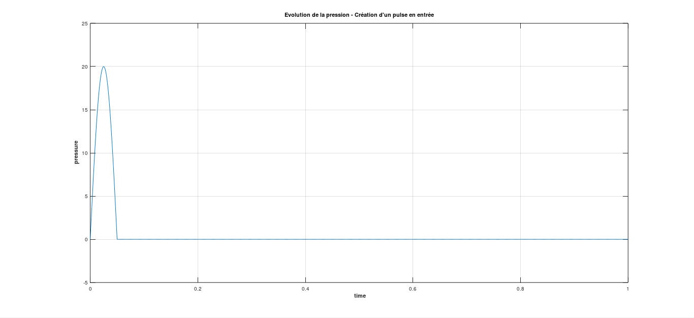

# Résultats du TP : 

**Présentation des cas étudiés et interprétation des résultats**

La première partie de notre travail dans ce cours s'est basée sur une simulation numérique 0D (ne considérant que le temps comme variable, donc n'ayant aucune dépendance spatiale), qui permet de modéliser la manière dont le sang s’écoule dans un vaisseau sanguin. 

C'est en retravaillant ce programme, en y ajoutant de nouvelles conditions d'entrée, de sortie et en testant différents paramètres de pression, élastance ou viscosité que nous avons pu mettre au point les résultats de la partie qui suit.

## Résultats : Nouvelle condition d'entrée - pulse

Comme le coeur envoie du sang dans les artères de manière pulsée, il fut rapidement envisagé de reproduire une pulsation à l'entrée du vaisseau que l'on souhaite modéliser.

Nous souhaitons donc reproduire une surpression à l'entrée du tube.
Pour modéliser cela, nous avons changé les paramètres de pression en entrée pour y faire intervenir une sinusoïde (pour obtenir des résultats plus lisibles).

La pression aurait donc la forme suivante en entrée :

puis, cette perturbation se propagerait tout le long du tube.

## Prise de pression et de débit à différents endroits dans le tube

