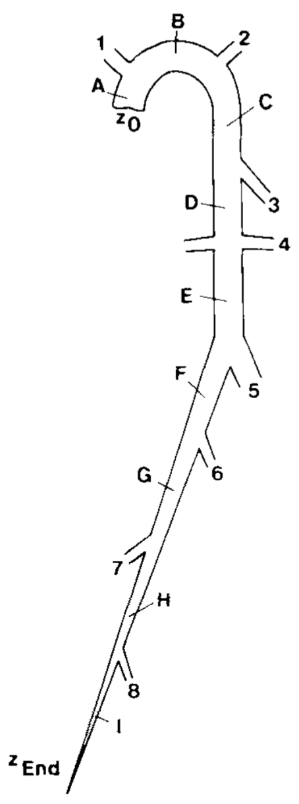

# Résultats du TP

**Présentation des cas étudiés et interprétation des résultats**

Vous décrirez ici vos cas tests (propagation d'un pulse dans un vaisseau, 
étude des réflexions aux conditions aux limites, etc...)
Préciser bien les valeurs de vos paramètres. Par exemple:
 - Elastance du tube EL=``1367000`` dyn/cm2
 - Section au repos A0=``0.1361`` cm2
 - Longueur du vaisseau L=``25`` cm
 - etc...

Bien entendu, vous illustrerez vos résultats par des figures pertinentes:

$\sum_{i=1}^n X_i$ 

