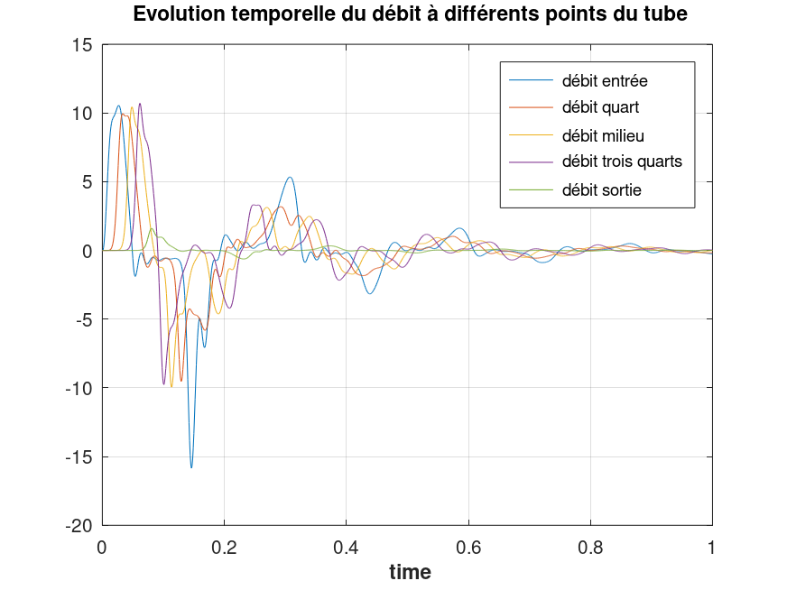

# Résultats du TP : 

**Présentation des cas étudiés et interprétation des résultats**

La première partie de notre travail dans ce cours s'est basée sur une simulation numérique 0D (ne considérant que le temps comme variable, donc n'ayant aucune dépendance spatiale), qui permet de modéliser la manière dont le sang s’écoule dans un vaisseau sanguin. 

C'est en retravaillant ce programme, en y ajoutant de nouvelles conditions d'entrée, de sortie et en testant différents paramètres de pression, élastance ou viscosité que nous avons pu mettre au point les résultats de la partie qui suit.

## Résultats : Nouvelle condition d'entrée - pulse

Comme le coeur envoie du sang dans les artères de manière pulsée, il fut rapidement envisagé de reproduire une pulsation à l'entrée du vaisseau que l'on souhaite modéliser.

Nous souhaitons donc reproduire une surpression à l'entrée du tube.
Pour modéliser cela, nous avons changé les paramètres de pression en entrée pour y faire intervenir une sinusoïde (pour obtenir des résultats plus lisibles).

La pression aurait donc la forme suivante en entrée :

puis, cette perturbation se propagerait tout le long du tube.
Si nous traçons cette perturbation de pression en entrée en fonction du temps, nous pouvons obtenir la figure suivante :

Les résultats relatifs aux essais avec cette nouvelle condition d'entrée pourront être développés par la suite.

## Prise de pression et de débit à différents endroits dans le tube

En reprenant la condition d'entrée introduite précédemment et en traçant la pression à la sortie du tube, il vient :

La pression en sortie est significativement supérieure au pulse imposé en entrée (plus de deux fois supérieure). Cela est dû notamment aux refléxions tout au long du tube, qui pousse une plus grande quantité à la fois à la sortie du tube et provoque une surpression.

Nous pouvons d'ailleurs mettre cela en parallèle avec l'évolution du débit à ces deux points de mesure : 

Un des problèmes pouvant limiter notre analyse dans ce TP est dû aux variables choisies pour tracer l'évolution des paramètres du tube. Si nous ne prenions que l'évolution au cours du temps de ce qu'il se passe en entrée et/ou en sortie, nous ne pourrions pas vérifier le fonctionnement intermédiaire du programme.

Pour y remédier et avoir un meilleur aperçu de l'évolution des paramètres le long du tube, nous pre

Le même affichage peut être mis en place pour la mesure des débits en fonction du temps :

