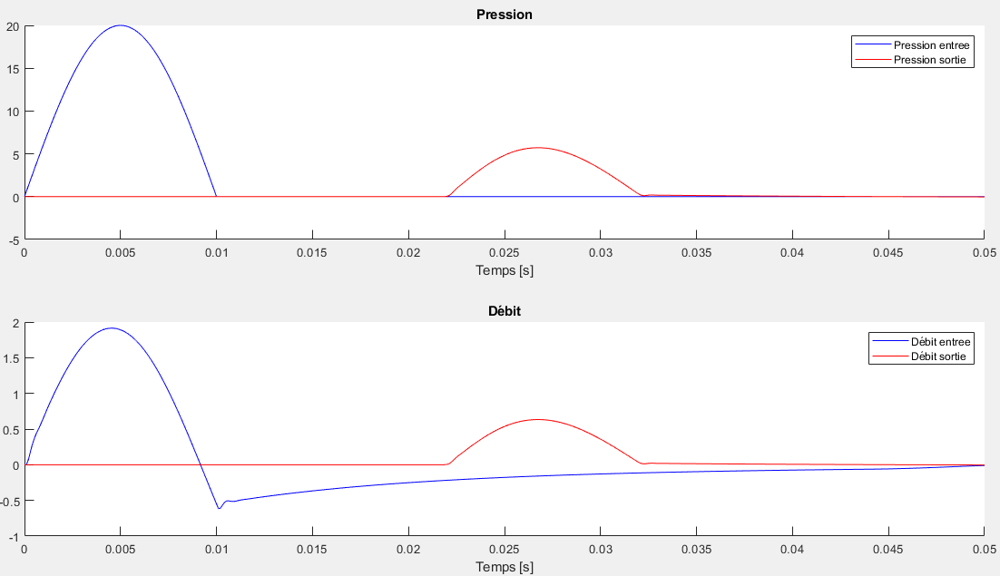

# Résultats du TP : 

**Présentation des cas étudiés et interprétation des résultats**

La première partie de notre travail dans ce cours s'est basée sur une simulation numérique 1D (ne considérant que la position longitudinale dans le tube et le temps comme variables), qui permet de modéliser la manière dont le sang s’écoule dans un vaisseau sanguin. 

C'est en retravaillant ce programme, en y ajoutant de nouvelles conditions d'entrée, de sortie et en testant différents paramètres que nous avons pu mettre au point les résultats de cette page.

&nbsp;

## **Sommaire**   

* [Présentation du programme initial](#Presentation)
* [Nouvelle condition d'entrée - pulse](#2)
* [Variation de la densité du sang passant dans le tube ](#3)
* [Variation de la viscosité du sang passant dans le tube ](#4)
* [Variation de la section du tube ](#6)
* [Tests complémentaires ](#5)
* [Essais de nouvelles conditions de sortie](#Sortie) 
     * [Cas d'une artère bouchée](#Stop) 
     * [Pression et débit nuls en entrée / Pression nulle en sortie](#Nul)
          * [Condition non-réflexive](#parefl)
          * [Condition réflexive](#refl)
* [Prise de pression et de débit à différents endroits dans le tube](#Diff)
* [Amélioration des résultats](#mieux)
    * [Modification de la vitesse de relevé des résultats](#CFL)
    * [Modification des périodes](#per)
* [Modélisation linéaire du tube](#Lin)

&nbsp;

# Présentation du programme initial 

Pour tous nos tests, nous avons eu recours à un programme simulant les évolutions de différents paramètres dans un tube soumis au passage d'un fluide.

Ce programme fonctionne initialement avec des valeurs par défaut, relatives aux caractéristiques du sang (supposé newtonien) passant dans une carotide : 

- Elastance du tube EL : ``1367000`` dyn/cm2
- Section du tube : ``0.1361`` cm2
- Densité du fluide : ``1.06`` [ssu]
- Viscosité du fluide : ``35`` millipoises [mP]
- Débit d'entrée : ``3.7370`` g/s
- Pression d'entrée : ``105.9632`` dyn/cm2
- Pression de sortie :  ``5.8317`` dyn/cm2
- Résistance périphérique ``34875`` dyme.s/cm 
- Compliance périphérique ``52049`` ml/dyn/cm2

Ici, la compliance est la capacité du tube à adapter son volume lorsqu'une variation de pression se produit et la résistance périphérique réfère à la résistance le long des parois du tube lors de l'écoulement du sang. Initialement, nous obtenions les résultats après avoir fait tourner le programme sur quatre périodes, d'une durée initale de 0.85s chacune.

L'une des tâches a donc été de modifier ces paramètres par défaut pour observer la réponse du programme et extrapoler à partir de ce modèle le fonctionnement d'un vaisseau quelconque. 

&nbsp;

Outre les paramètres, nous avons également pu modifier la manière dont entre ou sort le fluide du tube étudié.
En imposant une condition particulière en entrée du tube sur le débit ou sur la pression, afin de reproduire une perturbation proche de celle d'un vaisseau ou même  sinusoïdale en entrée, puis avec des conditions en fin de tube permettant notamment de provoquer ou non une réflexion de la perturbation, il a été possible d'obtenir différents cas de figure à traiter.

# Nouvelle condition d'entrée - pulse 

Comme le coeur envoie du sang dans les artères de manière pulsée, il fut rapidement envisagé de reproduire une pulsation à l'entrée du vaisseau que l'on souhaite modéliser.

Nous souhaitons donc reproduire une surpression à l'entrée du tube.
Pour représenter cela, nous avons changé les paramètres de pression en entrée pour y faire intervenir une sinusoïde (pour obtenir des résultats plus lisibles).

La pression aurait donc la forme suivante en entrée :

puis, cette perturbation se propagerait tout le long du tube.
Si nous traçons cette perturbation de pression en entrée en fonction du temps, nous pouvons obtenir la figure suivante :

Les résultats relatifs aux essais avec cette nouvelle condition d'entrée seront développés par la suite.

# Variation de la densité du sang passant dans le tube 

Ici, nous avons choisi de tester le comportement de notre modèle en mettant en évidence l'impact de la densité du sang qui le traverse sur l'évolution de la pression et du débit, en entrée et en sortie du tube.

Ici, le tube choisi a une longueur de 20cm et nous fixerons la viscosité à 10 millipoises (0.01 dans le code) pour tous les tests de cette section. Les autres paramètres sont similaires à ce qui a été établi précédemment (nous conservons un pulse en entrée).

En considérant que le fluide traversant le tube possède une densité de 0.01, puis une densité de 0.1, la pression et le débit - en entrée et en sortie du tube - sont de la forme suivante : 

 <!-- Image à gauche -->
 <!-- Image à droite -->

pulse pour une densité de 0.01/ de 0.1

On remarque ainsi que la pression baisse entre l’entrée et la sortie quand la densité est inférieure à 1. Pour vérifier si ce phénomène persiste avec une densité égale ou supérieure à l'unité, nous l'augmentons encore : 

 <!-- Image à gauche -->
 <!-- Image à droite -->

pulse pour une densité de 1/ de 5

Au delà de l'unité, il n'y a plus de distinction notable entre l'entrée et la sortie du tube.

&nbsp;

Par la suite, nous testons des valeurs encore supérieures pour la densité du fluide, afin de suivre l'évolution qualitative de l'aspect des courbes lors de l'augmentation de ce paramètre : 

 <!-- Image à gauche -->
 <!-- Image à droite -->

pulse pour une densité de 10/ de 25

&nbsp;

 <!-- Image à gauche -->
 <!-- Image à droite -->

pulse pour une densité de 50/ de 100

&nbsp;

 <!-- Image à gauche -->
 <!-- Image à droite -->

pulse pour une densité de 500/ de 1000

Augmenter la densité décale les courbes en sortie du tube par rapport à celles d'entrée. Ainsi, le pulse imposé en entrée met plus de temps à se propager vers la fin du tube lorsque la densité du fluide est élevée. Autrement dit, la vitesse de propagation de la perturbation diminue puisqu'elle met plus de temps à atteindre l'autre extrémité du tube.

&nbsp;

On peut par ailleurs déduire graphiquement la vitesse des ondes qui se propagent en mesurant la différence de temps entre les 2 maxima des courbes : 

(vu que le pulse met le même temps pour arriver à la sortie dans les deux cas ci-dessus, on mesure indifféremment sur l'évolution de la pression ou du débit)

Dans le cas exposé ci-contre, nous avons une densité de 50. Ici, il y a une différence de 0.175-0.025 = 0.150s entre le pulse en entrée et celui en sortie. 

Puisque nous connaissons la longueur L du tube, ainsi que le temps mis pour le traverser, nous pouvons obtenir la vitesse de la manière suivante :

De fait, pour ce test ci, le pulse va a une vitesse de :

En réitérant l'essai par exemple pour une densité de 100, nous obtenons une différence de temps de 0.21s, et donc une vitesse proche de 0.95m/s. Cela prouve bien la diminution de la vitesse lors de l'augmentation de la densité du fluide circulant dans le tube.

# Variation de la viscosité du sang passant dans le tube 

Dans cette partie, nous cherchons l'influence de la viscosité du sang sur l'évolution de la pression et du débit, en entrée et en sortie du tube.
Nous réutilisons le pulse introduit précédemment, ainsi que tous les paramètres initiaux (hormis la viscosité).

Pour un fluide ayant une viscosité très faible, par exemple de l'ordre de 1 à 1.10-4 mP (0.001 et 0.0000001 poises dans le code), on obtient les pressions et débits en entrée et en sortie du tube suivants : 

 <!-- Image à gauche -->
 <!-- Image à droite -->

pulse pour une viscosité de  1.10-4 / 1 mP

&nbsp;

Le pulse est arrivé dans ces deux cas à la sortie sans perdre en intensité. En omettant dans cette partie l'action de la résistance périphérique du tube, on peut supposer que les pertes de charge sont négligeables dans ces essais.
Une viscosité trop faible n'altère donc aucunement l'intensité ni l'aspect de la perturbation imposée en entrée.

&nbsp;

D'autres essais pour des viscosités plus importantes nous donnent les figures ci-contre :

 <!-- Image à gauche -->
 <!-- Image à droite -->

pulse pour une viscosité de 100 / de 200 mP

&nbsp;

Ici, les perturbations imposées en entrée ressortent en ayant perdu en intensité. Nous pouvons donc vraisemblablement affirmer que la viscosité du fluide commence à amortir le pulse d'entrée. 

D'autre part, une réflexion en entrée commence à se distinguer pour une viscosité de l'ordre de 100 mP. 
Juste après le pulse imposé, une partie du fluide est directement renvoyée vers l'entrée, ce qui laisse apparaître un débit négatif. L'augmentation de la viscosité du fluide rend donc à priori l'onde imposée en entrée plus sujette à subir des réflexions, vu que le fluide résiste plus au mouvement et au passage de la perturbation.

&nbsp;

On vérifie cela en prenant des viscosités plus élevées :

 <!-- Image à gauche -->
 <!-- Image à droite -->

pulse pour une viscosité de 500 / de 1000 mP

&nbsp;

L'apparition d'un débit négatif est d'autant plus marquée que la viscosité est élevée, comme attendu. 

Aux temps longs, les débits d'entrée et de sortie tendent à prendre une même valeur nulle aux temps longs puisque la perturbation est passée et n'impacte plus le passage du fluide dans le tube.

&nbsp;

Si on augmente encore la viscosité du fluide :

pulse pour une viscosité de 10 000 mP (zoom sur le pulse en sortie à droite)

A ce stade, la viscosité du fluide est suffisamment importante pour que le pulse imposé en entrée soit quasiment totalement amorti en sortie du tube. 

&nbsp;

Pour les premiers essais, les signaux en entrée et en sortie sont à chaque fois repérés au mêmes instants (il faut environ 0.022s pour que le pulse arrive à la sortie du tube). Les modifications opérées sur la viscosité du fluide n'ont donc à priori pas impacté la vitesse du pulse. 

Mais si on prend des viscosités supérieures, à partir de 500mP, le pic de pression en sortie commence à s'étaler sur la fin, même si le signal arrive en sortie du tube aux mêmes temps que précédemment. On pourra donc en conclure que la viscosité n'a qu'un impact très faible sur la vitesse de la perturbation pour nos essais.

# Variation de de la section du tube 

#  Tests complémentaires 

On prend en condition d’entrée une pression à l’entrée du tube constante (on prend un cas où la pression en entrée est non sinusoïdale) et une condition de sortie de type Windkessel simple (une condition réflexive).

**Démarche d’étude :**

On choisit des pressions de tel sorte à avoir un écoulement (Pentrée ≠ Psortie). On obtient donc lors du tracé de du débit en sortie du tube en fonction du temps des débits qui se stabilise et devient constant au cours du temps. Le but est de faire une étude paramétrique donc on change au fur et à mesure les valeurs de la section A0 dans un premier temps (ensuite les valeurs de la longueur du tube et de l’elastance) et on prélève les valeurs de débit à la sortie du tube directement du graphique (débit, temps) pour pouvoir tracer la courbe d’évolution du débit en sortie du tube en fonction des différentes valeurs de section
(ensuite des différentes valeurs de longueur du tube et d’elastance).

- Courbe du débit en sortie en fonction de la section :

&nbsp;

En général :

Le débit est le volume de fluide par unité de temps qui passe devant un point à travers une
surface A. 

Ici, le cylindre ombragé de fluide passe devant le point P dans un tuyau uniforme
en un temps t. Le volume du cylindre est Ad et la vitesse moyenne est v =d/t.
Le débit s’écrit donc :

Donc le débit Q est proportionnel à la section A d’après la formule donnée.
D’après la figure ci-contre qui donne l’évolution du débit en sortie du tube en fonction de la section,
on remarque que la représentation graphique de cette évolution est une droite linéaire affine. Donc la courbe traduit bien la proportionnalité de la section par rapport au débit.
(Plus la valeur de la section augmente plus le débit en sortie du tube est important)

&nbsp;

- Courbe du débit en sortie en fonction de l’elastance :

On sait que le débit (ml) est inversement proportionnel à l’elastance (E =DP/DV)
. Ici on a :
La loi du tube qui s’écrit : A(I)=A0*(P(I)/EL+1))
Et le débit Q=A(I)*U(I) donc Q= A0*(P(I)/EL+1)*U(I)

D’après la figure ci-dessus qui donne l’évolution du débit en sortie du tube en fonction de
l’élastance du tube, on remarque qu’on obtient une hyperbole qui est généralement la
représentation graphique d’une fonction inverse y=1/x. Donc la courbe est bien en accord
avec la relation liant le débit et l’elastance. Dans la figure 2 on remarque également que
plus la valeur de l’élastance est grande moins le débit en sortie du tube est important.

&nbsp;

- Courbe du débit en sortie du tube en fonction de la longueur du tube :

En général :

La loi de Poiseuille nous donne la relation liant le débit volumique, la viscosité dynamique
du fluide, la différence de pression, le rayon et la longueur du tube :

Donc, de la formule ci-dessus on peut dire que le débit varie de manière inversement
proportionnelle à la longueur.
D’après la troisième figure de cette partie, qui donne l’évolution du débit du fluide en sortie du tube en fonction de
différentes valeurs de longueur du tube, on remarque qu’on obtient une courbe qui se
rapproche plus d’une droite linéaire décroissante et qui traduit donc une proportionnalité.
Cela va en contradiction avec la formule donnée par la loi de poiseuille. Pour donner une
explication à cela on peut dire que la linéarité qu’on remarque sur la courbe est due aux
frottements.

# Essais de nouvelles conditions de sortie :  

## Cas d'une artère bouchée : 

Dans ce cas-ci on a mis en place un pulse à l'entrée de l'artère et on impose un débit nul en sortie afin de simuler une artère bouchée. 
On obtient l'évolution du débit à l'entrée suivant :

On voit clairement l'onde qui revient, en débit négatif, puis qui repart après un rebond, ce sont les réflexions de l'onde. Les pics du débits décroissent en fonction du temps, cela est dû à la viscosité. On peut essayer de l'estimer en modélisant sur matlab la pente.

## Pression et débit nuls en entrée / pression nulle en sortie  

Dans cette section, nous envisageons de considérer que la pression et le débit à l'entrée du tube sont nuls. Ainsi, nous ne devrions qu'avoir à prendre en compte la perturbation provoquée par le pulse que nous imposerons en entrée. On testera également le fait d'annuler la pression en sortie.

### Condition non-réflexive 

Les résultats présentés ici seront basés sur les paramètres suivants :

- Elastance du tube EL : ``1367000`` dyn/cm2
- Section du tube A0 : ``0.1361`` cm2
- Longueur du tube  L : ``25`` cm
- Densité du fluide : ``1.06`` kg/m3
- Viscosité du fluide : ``35`` millipoises [mP]

On travaille sur un fluide supposé newtonien, la viscosité sera donc supposée constante. Afin d'avoir des résultats plus visibles, nous avons fait tourner le programme sur 20 périodes (on se concentrera principalement sur la hauteur des premiers pics et sur les éventuelles réflexions, donc un tel affichage est plus efficace).

&nbsp;

En reprenant la condition d'entrée introduite précédemment et en traçant la pression à la sortie du tube, sans modifier les pressions et débits par défaut, il vient :

La pression en sortie est légèrement supérieure que celle imposée en entrée. Cela pourrait provenir du fait que, malgré la condition non-réflexive imposée, quelques réflexions se produisent tout au long du tube. Ces réflexions pourraient finir par pousser une plus grande quantité à la fois à la sortie du tube, le tout provoquant une surpression. Une autre hypothèse basée sur la vitesse de relevé des informations tout au long du tube dans notre programme sera explicitée par la suite.

&nbsp;

En annulant cette fois les pressions et débits en entrée, nous pouvons obtenir ce qui suit :

t d

Cette fois, la pression en sortie est significativement supérieure à celle imposée par le pulse en entrée (le pic est deux fois supérieur). Ici, la première hypothèse fournie est plus crédible, puisque le pulse se réfléchit nettement plusieurs fois - bien plus que dans au cas où nous avions des pressions non-nulles aux extrémités - malgré la non-relféxivité imposée. La surpression s'explique donc d'autant mieux que l'on peut observer les réflexions partielles.

Cependant, l'annulation des paramètres cités inhibe l'effet de la condition de sortie choisie. Nous étions censés n'observer aucune réflexion en fin de tube, mais le fait d'annuler la pression à la fin oblige à priori une partie du pulse envoyé en entrée à se réfléchir.

&nbsp;

Nous pouvons mettre cela en parallèle avec l'évolution du débit à ces deux points de mesure : 

Dans cette configuration, le sang réfléchi dans le sens inverse de l'écoulement peut ressortir du tube par l'entrée, puisque le tube n'y est pas bouché, d'où le débit négatif observé peu de temps après le pic de débit en sortie. C'est ce que nous avions déjà pu observer en bouchant le tube en amont.

&nbsp;

Lorsque nous annulons les pressions et débits en entrée, nous obtenons la figure suivante pour les débits :

Le débit en sortie du tube est bien moins important qu'en entrée, tandis qu'un important pic négatif (courbe bleue) se profile après le signal en sortie.
Ce débit négatif observé en entrée est très important mais s'amoindrit rapidement lorsqu'une première réflexion s'est produite. 

La condition de sortie ne peut toujours pas être parfaitement respectée si l'on impose une pression nulle en sortie. 

### Condition réflexive 

Cette fois, nous tentons d'annuler la pression en entrée et en sortie, ainsi que le débit en entrée tout en prenant une condition à priori réflexive :

 <!-- Image à gauche -->
 <!-- Image à droite -->

sans annuler les paramètres (à gauche) / en annulant (à droite) - pression

&nbsp;

 <!-- Image à droite -->
 <!-- Image à gauche -->

sans annuler les paramètres (à gauche) / en annulant (à droite) - débit

Pour l'évolution de la pression comme celle du débit, nous obtenons avec les paramètres initiaux des résultats très similaires à ce que nous avions pu trouver en bouchant le tube avec un débit nul en sortie.

Dans les conditions standard, le débit en sortie est quasiment nul tandis que celui en entrée atteste à priori de multiples réflexions.

Ces observations viennent naturellement de la condition de sortie imposée dans notre programme. En effet, nous considérons ici une condition de type Windkessel en sortie du tube. La résistance périphérique y est définie par : 

Où Q est le débit à l'endroit considéré. Ainsi, le débit est d'autant plus faible en sortie que la résistance considérée y est importante (elle est de 34875 dyme.s/cm  dans notre cas). Une quantité notoire de sang va être réfléchie en sortie du tube et seulement une faible partie traversera effectivement la sortie. De fait, le débit en sortie est bien plus faible qu'ailleurs.

&nbsp;

Pour les figures obtenues en annulant les pressions aux extrémités ainsi que le débit en entrée, nous n'obtenons plus de phénomène de réflexion aussi marqué. Comme précédemment, l'onde n'est pas totalement réfléchie (nous avons un pic de débit en sortie), donc la condition de sortie n'est pas pleinement respectée.

Mais à présent, nous pouvons à priori trouver une explication pour l'intensité du pic de pression en sortie, qui est toujours aussi élevée que pour l'autre condition de sortie. Comme nous avons de multiples réflexions, on peut s'attendre à avoir une plus grande pression dans une même zone. L'onde qui se propage initialement va croiser des réflexions et s'additionner avec, notamment en sortie où nous venons d'imposer une condition proche de celle du tube bouché.

&nbsp;

Au final, nous pourrions affirmer que l'annulation des pressions (plus encore que l'annulation du débit en entrée) a un plus grand impact sur l'évolution du pulse dans le tube que les conditions imposées en sortie. Dans les deux cas testés, nous obtenons des résultats se situant dans une sorte d'entre-deux, une partie de l'onde se réflechit et le reste traverse effectivement le tube, et ce indépendamment de ce que l'on tente d'imposer aux extrémités.

# Prise de pression et de débit à différents endroits dans le tube  

Un des problèmes pouvant limiter notre analyse dans ce TP est dû aux endroits choisis dans le tube pour tracer l'évolution des paramètres. Si nous ne prenions que l'évolution au cours du temps de ce qu'il se passe en entrée et/ou en sortie, nous ne pourrions pas vérifier le fonctionnement intermédiaire du programme.

Pour y remédier et avoir un meilleur aperçu de l'évolution des paramètres le long du tube, nous prenons des mesures également au milieu de celui-ci.

(nous reprenons les conditions standard, avec un pulse en entrée et une condition de Windkessel simple en sortie)

Le même phénomène de reflux est perceptible au milieu du tube, même s'il est moins prononcé qu'en sortie.

Autrement, on peut déjà voir ici que la pression n'a plus la même allure au milieu du tube, le pic y étant plus faible qu'en entrée. 
La résistance périphérique n'étant pas nulle pour notre essai, il se peut que des pertes de charge tout au long du tube soient à l'origine de cette modification.

&nbsp;

Pour vérifier cela, on peut augmenter encore le nombre de points de mesure :

En réalité, les pics de pression relevés tout au long du tube semblent décroître, en partant de la sortie du tube et jusqu'au quart de celui-ci.
L'hypothèse des pertes de charge ne permet donc pas à priori d'expliquer une telle évolution de la pression dans le tube.

 # Amélioration des résultats 

Nous allons tenter ici d'améliorer les résultats présentés dans la partie précédente.

## Modification de la vitesse de relevé des résultats 

Nous avons pu envisager que les résultats précédemment obtenus étaient peut-être dûs à un mauvais relevé des pressions au cours du temps. 

En effet, pour relever les données de pression, il nous faut mettre en place un schéma de calcul suffisamment en avance sur l'onde à analyser pour pouvoir relever des résultats, sans pour autant être trop rapide pour ne pas omettre des informations pouvant être trop éloignées temporellement de ce que l'on souhaite obtenir.
Cette condition de 'vitesse de relevé' à respecter, la condition CFL, pourrait être à l'origine de nos résultats inexplicables.

Nous sommes partis de base sur un CFL valant 3 fois la vitesse de l'onde produite dans notre modèle. En prenant une condition CFL de 2.5 fois la vitesse de l'onde, nous obtenons la figure suivante : 

Evolution de la pression - CFL de 2.5

Il apparaît en effet bien, cette fois-ci, que le pic diminue jusqu'à ce que l'on arrive aux trois quarts du tube. Le niveau du pic repart cependant encore à la hausse après ce passage. 

&nbsp;

Nous essayons donc encore de réduire cette condition CFL, cette fois ci à 2.2 fois la vitesse de l'onde :

Evolution de la pression - CFL de 2.2

Nous obtenons des résultats similaires à ce que nous avions précédemment. 

La condition CFL n'étant pas remplie indéfiniment, nous ne pouvons plus obtenir de résultats pour une vitesse de relevé égale ou inférieure à 2.1 fois celle de l'onde. L'onde étant déjà passée dans la zone 'traitée' par notre schéma de calcul à un instant t, nous ne pouvons plus rien en retirer.

Le meilleur résultat que nous pourrons donc obtenir est celui présenté ci-dessus.

Il est plus envisageable à présent de considérer que les pertes de charge soient bien à l'origine des différences tout au long du tube.

L'écoulement étant freiné au cours de son évolution, notamment au niveau des parois et à cause de sa viscosité, il ne peut pas y avoir exactement la même quantité de sang à chaque endroit du tube à un instant t, une partie étant restée en arrière. Cela peut bien expliquer cette différence de pression dans notre tube.

&nbsp;

Ce même affichage peut être mis en place pour la mesure des débits en fonction du temps :

Evolution du débit - CFL de 2.2

Ici, le débit en sortie diminue drastiquement à cause de la condition imposée en sortie mais les pics de débit diminuent à priori de la même manière que pour la pression et à cause des mêmes pertes de charge au long du tube.

## Modification des périodes 

Par défaut, nous avons choisi de prendre dans la partie précédente 20 périodes, d'une durée de 0.05s chacune pour notre modèle. 

Nous avons donc tenté de changer ces paramètres, pour trouver une possible source d'erreur dans nos affichages. Ici, nous réutiliserons une condition de sortie non-réflexive pour présenter nos résultats, ce qui nous permettra de faire des comparaisons plutôt sur le début de l'éxécution de notre programme (là où nos avions le plus de non-linéarités dans la partie précédente) et d'omettre les (éventuelles) limites d'un affichage trop restreint pour observer les réflexions successives.

Nous n'explicitons que les figures obtenues pour l'évolution du débit dans le tube, mais les résultats obtenus pour d'autres paramètres comme la pression sont similaires.

&nbsp;

Précédemment, nous avions effectué nos tests avec des périodes de très courte durée (0.05s). Ce choix s'est basé en grande partie sur une recherche de rapidité d'éxécution du code, puisque la vitesse d'éxécution augmentait d'autant plus que les périodes étaient longues. 

Un essai à entreprendre était donc d'augmenter la durée des périodes. Pour conserver un programme qui fonctionne en un temps raisonnable, nous avons dû diminuer en parallèle le nombre de périodes.
Pour 10 périodes de 0.1s et de 0.25s chacune, nous obtenons :

 <!-- Image à droite -->
 <!-- Image à gauche -->

Evolution du débit - 10 périodes de 0.1s / 0.25s

On peut clairement voir qu'en augmentant la durée des périodes, les phénomènes non-linéaires présents juste après l'affichage du pulse qui se propage se dissipient. 
Cependant, l'affichage n'est pas encore acceptable avec ces paramètres puisque les pulses relevés à différents endroits du tube semblent se superposer, notamment à cause du nombre trop élevé de périodes que l'on a pris.

&nbsp;

On augmente donc encore la durée, mais en diminuant cette fois le nombre de périodes :

Evolution du débit - 5 périodes de 0.5s

De cette manière, on peut retrouver l'évolution temporelle du pulse imposé en entrée, sans avoir d'effets dûs à la non-linéarité.

&nbsp;

On peut encore tenter de diminuer la durée des 5 périodes, pour réduire le temps de calcul :
 
 <!-- Image à droite -->
 <!-- Image à gauche -->

Evolution du débit - 5 périodes de 0.25s / 0.1s

On retombe sur des résultats peu fiables vers la fin de l'éxécution, notamment pour 0.10s. On ne pourra donc à priori pas beaucoup réduire le temps de calcul tout en obtenant de bons résultats.

Nous considèrerons donc que l'on peut obtenir des résultats exploitables avec 5 périodes de 0.5 - 0.25s chacune, ce qui se rapproche relativement bien des données implémentées par défaut dans le programme utilisé. Néanmoins, comme nous avons fait des tests avec un tube non-réflexif, ces paramètres ne resteront pas nécessairement adéquats pour traiter un autre type de condition limite, notamment des conditions impliquant des réflexions pour lesquelles on souhaiterait avoir une plus grande plage de données pour analyser l'évolution. 

# Cas linéaire :  

Pour tous nos affichages précédents, il est clair que nos résulats restent peu fiables, principalement à cause des non-linéarités présentes de base dans le modèle utilisé lors de l'élaboration de ce tube 1D. 
Il sera donc présenté ici une amélioration de cette modélisation, ne présentant plus qu'une évolution linéaire.

